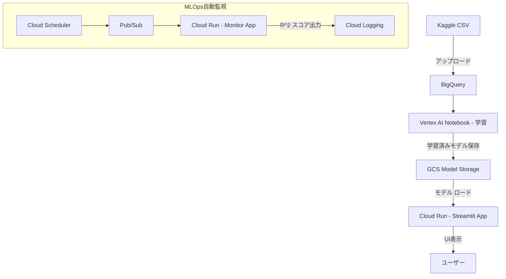

# 学生の成績予測アプリ (Streamlit + LightGBM + Cloud Run)

## はじめに

- Kaggle「Students Performance in Exams」のデータセットを活用
- LinearRegression・LightGBM・SHAPを用いて学習成果を予測 
- 学生の様々な属性（性別、人種、親の学歴など）と中間スコア（リーディング・ライティング）を入力 
- 最終的な数学スコアを予測する **機械学習Webアプリケーション** 
- Google Cloud Platform (GCP) の **Cloud Run** を利用
- サーバーレスでコンテナ化された **Streamlitアプリ** として公開
- **Cloud Scheduler**でR²監視を自動化し、継続的に運用
- 教師として得たドメイン知識をAI実装に結び付けた事例
- 効果:作業時間80%削減

---

## 公開サイト

 https://streamlit-math-predictor-218616351259.asia-northeast1.run.app/

---

## アーキテクチャ構成図

## 目的・価値

### なぜアプリ化が必要だったか

教育現場では、機械学習モデルを構築しても Jupyter Notebook 止まりで以下の課題がありました：

- 他の教員が使えない（Pythonの知識が必要）  
- リアルタイムでの予測ができない  
- 保護者面談で共有しづらい  

### アプリ化によるメリット

| 対象 | メリット |
|------|-----------|
| 教員 | Python知識不要・クリック操作のみで利用可能 |
| 生徒・保護者 | 成績予測を視覚的に確認でき、納得感のある指導が可能 |
| 学校 | 複数人同時アクセス・意思決定の迅速化 |

### ROI（投資対効果）
- 開発コスト：約20時間
- 運用コスト：ほぼ0円（無料枠）
- 効果：作業時間80%削減、意思決定速度5倍向上

---

## 機能一覧

| 機能 | 説明 |
|------|------|
| **モデル選択機能** | LinearRegression または LightGBM を選択して実行可能 |
| **SHAP値可視化** | 個別生徒の予測要因をWaterfallグラフで表示 |
| **GCS連携** | モデル・特徴量ファイルをGoogle Cloud Storageに自動保存／ロード |
| **自動監視パイプライン** | Cloud Scheduler × Pub/Sub × Cloud Runで、毎日R²スコアを自動チェック |
| **再現性設計** | BigQuery→学習→モデル保存→Cloud Runデプロイまでを自動化 |

---

## 使用技術

| 分類 | 技術 |
|------|------|
| フロントエンド | Streamlit |
| 機械学習 | scikit-learn（LinearRegression）, LightGBM, SHAP |
| データ処理 | pandas, BigQuery |
| インフラ | GCP (Cloud Run / Cloud Build / Cloud Storage / Pub/Sub / Scheduler) |
| 言語 | Python |

---

## データ概要

- **出典**：Kaggle - *Students Performance in Exams*  
- **構成**：性別、人種・民族、親の学歴、昼食タイプ、試験準備コース、Reading/Writingスコア  
- **目的変数**：数学スコア (`math_score`)  

再現のための設定手順：
1. GCPコンソールでBigQueryを開き、新しいデータセットを作成  
2. CSVファイルをアップロードしてテーブルを作成  
3. `model_train.ipynb` の `BQ_TABLE_PATH` にテーブルパスを設定  

---

## モデル構築・評価

| モデル | R²スコア (test) | 特徴 |
|--------|------------------|------|
| LinearRegression | 0.855 | シンプルで解釈性が高い |
| LightGBM | 0.871 | 非線形関係を補足し高精度 |

### SHAP可視化例
個別予測に対する要因寄与をWaterfallグラフで確認できます。  
どの特徴（例：`reading_score` や `test_preparation_course`）がスコアに影響したかを可視化。

---

## 注意事項（デプロイと再現性について）
- 学習済みモデルの非公開: 学習済みモデルファイル（LinearRegression.pkl, LightGBM.pkl, および feature_list.pkl）は、機密保持に従い、GitHub上では公開していません。
- 再現方法: 本プロジェクトを再現される際は、同梱の model_train.ipynb を実行し、ご自身の環境でモデルを再学習してください。
- データの前処理: BigQueryなどの環境で問題が発生しないよう、コード内では列名のスペースをアンダースコア (_) に変換する処理を行っています。
- **同梱の model_train.ipynb にあるPROJECT_ID,BQ_TABLE_PATH,GCS_BUCKET_NAMEについてはご自身の環境に応じて入力をしてください。
