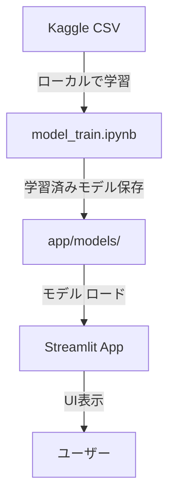
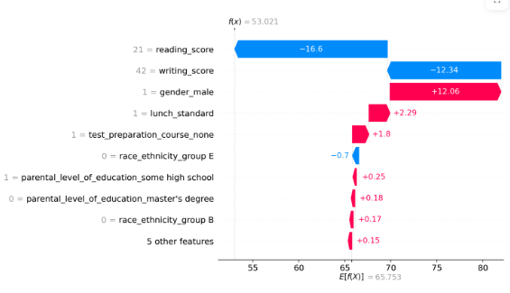

# 学生の成績予測アプリ (Streamlit + LightGBM)

## はじめに

- Kaggle「Students Performance in Exams」のデータセットを活用
- LinearRegression・LightGBM・SHAPを用いて学習成果を予測 
- 学生の様々な属性（性別、人種、親の学歴など）と中間スコア（リーディング・ライティング）を入力 
- 最終的な数学スコアを予測する **機械学習Webアプリケーション** 
- **Streamlit** 単体で動作するスタンドアロン構成（モデルはリポジトリに同梱、外部クラウド接続は不要）
- 教師として得たドメイン知識をAI実装に結び付けた事例

---

## アーキテクチャ構成図


```mermaid
flowchart TD
    A[Kaggle CSV] -->|ローカルで学習| B[model_train.ipynb]
    B -->|学習済みモデル保存| C[app/models/]
    C -->|モデル ロード| D[Streamlit App]
    D -->|UI表示| E[ユーザー]
```

## 目的・価値

### なぜアプリ化が必要だったか

教育現場では、機械学習モデルを構築しても Jupyter Notebook 止まりで以下の課題がありました：

- 他の教員が使えない（Pythonの知識が必要）  
- リアルタイムでの予測ができない  
- 保護者面談で共有しづらい  

### アプリ化によるメリット

| 対象 | メリット |
|------|-----------|
| 教員 | Python知識不要・クリック操作のみで利用可能 |
| 生徒・保護者 | 成績予測を視覚的に確認でき、納得感のある指導が可能 |
| 学校 | 複数人同時アクセス・意思決定の迅速化 |

---

## 機能一覧

| 機能 | 説明 |
|------|------|
| **モデル選択機能** | LinearRegression または LightGBM を選択して実行可能 |
| **SHAP値可視化** | 個別生徒の予測要因をWaterfallグラフで表示 |
| **ローカルモデル読込** | リポジトリに同梱した学習済みモデル(.pkl)をそのまま読み込み |

---

## 使用技術

| 分類 | 技術 |
|------|------|
| フロントエンド | Streamlit |
| 機械学習 | scikit-learn（LinearRegression）, LightGBM, SHAP |
| データ処理 | pandas |
| 言語 | Python |

---

## データ概要

- **出典**：Kaggle - *Students Performance in Exams*  
  https://www.kaggle.com/datasets/spscientist/students-performance-in-exams
- **構成**：性別、人種・民族、親の学歴、昼食タイプ、試験準備コース、Reading/Writingスコア  
- **目的変数**：数学スコア (`math_score`)  

再現のための設定手順：
1. Kaggleから `StudentsPerformance.csv` をダウンロードし、`data/StudentsPerformance.csv` に配置
2. `model_train.ipynb` を実行して `app/models/math_predictor/v1/` にモデルを出力

---

## モデル構築・評価

| モデル | R²スコア (test) | 特徴 |
|--------|------------------|------|
| LinearRegression | 0.880 | シンプルで解釈性が高い |
| LightGBM | 0.844 | デフォルトパラメータでは今回のデータ規模（1000行）だと分割が進みにくく、Linearよりやや低精度 |

本データセットは1000行程度と小規模なため、デフォルト設定のLightGBMは十分な非線形パターンを学習しきれず、シンプルなLinearRegressionの方が汎化性能で上回る結果になりました。「モデルが複雑＝高精度とは限らない」ことを示す例として、あえて数値はそのまま残しています。

### SHAP可視化例
個別予測に対する要因寄与をWaterfallグラフで確認できます。  
どの特徴（例：`reading_score` や `test_preparation_course`）がスコアに影響したかを可視化。


---

## ローカルでの実行

```bash
cd app
pip install -r requirements.txt
streamlit run app.py
```

## Dockerでの実行

```bash
cd app
docker build -t students-math-predictor .
docker run -p 8080:8080 students-math-predictor
```

## Streamlit Community Cloudへのデプロイ

1. 本リポジトリをGitHubにpush（`app/models/` にモデルファイルを含めること）
2. [share.streamlit.io](https://share.streamlit.io/) でリポジトリを連携
3. Main file path に `app/app.py` を指定してデプロイ

---

## 注意事項（再現性について）
- `model_train.ipynb` を実行する際は、同梱の `data/StudentsPerformance.csv`（Kaggleからダウンロードして配置）を使用してください。
- データの前処理: 列名のスペースをアンダースコア (`_`) に変換する処理を行っています（`race/ethnicity` はスラッシュのまま）。
